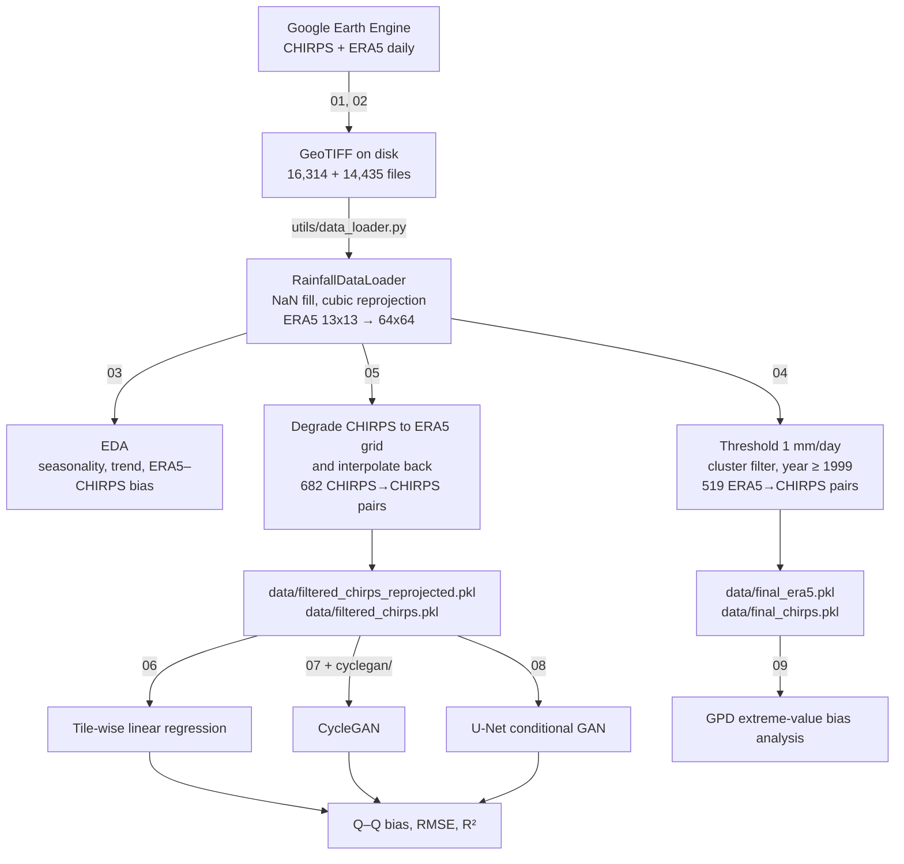

# Rainfall Downscaling

Learning a generative map from coarse ERA5 reanalysis (0.25°, ~25 km) to CHIRPS-resolution
daily precipitation (0.05°, ~5 km) over Uttarakhand, India — compared across three approaches:
a tile-wise linear regression baseline, a CycleGAN, and a U-Net conditional GAN.

Coursework project for **EE708**.

---

## Contents

- [The problem](#the-problem)
- [Data](#data)
- [Pipeline](#pipeline)
- [EDA and filtering](#eda-and-filtering)
- [Method 1 — tile-wise linear regression](#method-1--tile-wise-linear-regression)
- [Method 2 — CycleGAN](#method-2--cyclegan)
- [Method 3 — U-Net conditional GAN](#method-3--u-net-conditional-gan)
- [Results](#results)
- [Extreme-value bias analysis](#extreme-value-bias-analysis)
- [Repository layout](#repository-layout)
- [Setup and reproduction](#setup-and-reproduction)
- [Known issues](#known-issues)
- [References](#references)

---

## The problem

Rainfall drives crop-yield modelling, reservoir and hydropower operation across the Ganges,
Indus and Brahmaputra basins, and flood and landslide warning in the Himalaya. Global
reanalyses such as ERA5 cover everything but resolve nothing local: at 0.25° a single cell
spans ~25 km, which in mountain terrain averages away exactly the variability that matters.
CHIRPS, blending satellite retrievals with station data at 0.05°, is the finer target.

The physically rigorous route — nesting a 5 km regional model inside the global one — costs
petabytes and months of cluster time for a multi-decade daily record. This project takes the
statistical route instead: learn the coarse-to-fine mapping directly from paired data.

The two products do not simply differ in sharpness. They disagree on where the rain is:


They also disagree systematically in magnitude. ERA5 overestimates light rain and
underestimates heavy rain relative to CHIRPS — visible as the S-shaped departure from the 1:1
line in the baseline Q–Q plot:


## Data

Both products were pulled from Google Earth Engine as daily GeoTIFFs over a fixed
Uttarakhand bounding box.

| | CHIRPS | ERA5 |
|---|---|---|
| GEE collection | `UCSB-CHG/CHIRPS/DAILY` | `ECMWF/ERA5/DAILY` |
| Native grid over the ROI | **64 × 64** | **13 × 13** |
| Resolution | 0.05° (~5 km) | 0.25° (~25 km) |
| Bands used | precipitation | air temperature, dewpoint temperature, total precipitation, u-wind, v-wind |
| Units | mm/day | precipitation in m/day, converted ×1000 to mm/day |
| Daily files exported | 16,314 | 14,435 |
| Coverage | 1981-01-01 → ~2025-08 | 1981-01-01 → 2020-07-09 |
| Value range observed | 0 – 710.4 mm/day | — |

**Region of interest** — polygon `(77.8, 31.9) (81.0, 31.9) (81.0, 28.75) (77.8, 28.75)`,
3.2° × 3.15°, geodesic area **107,458 km²**, centred at (30.32 N, 78.88 E). ERA5's record in
the GEE `ECMWF/ERA5/DAILY` collection ends 2020-07-09, which caps the paired data.

**ERA5 channel order** used everywhere in this repo (`utils/data_loader.py:65`):

| Index | Variable | Source band |
|---|---|---|
| 0 | air temperature | 1 |
| 1 | dewpoint temperature | 4 |
| 2 | **total precipitation** (×1000 → mm/day) | 5 |
| 3 | u-wind | 8 |
| 4 | v-wind | 9 |

Channel 2 is the precipitation channel referenced by every model notebook.

ERA5 is resampled from its 13 × 13 native grid onto the 64 × 64 CHIRPS grid with
`rasterio.warp.reproject(..., Resampling.cubic)` (`utils/data_loader.py:32`), preserving each
collection's own CRS and transform from export. NaNs are filled with 0 on load.

## Pipeline



Two paired datasets come out of this, and the distinction matters when reading the results:

- **ERA5 → CHIRPS** (519 pairs) — the real task. Cross-product, so the model must absorb
  ERA5's systematic bias as well as add detail.
- **Degraded CHIRPS → CHIRPS** (682 pairs) — an idealised task. The input is CHIRPS pushed
  down to the ERA5 grid and interpolated back up, so it is a pure super-resolution problem
  with no cross-product bias. Every headline model here is trained on this second set.

## EDA and filtering

Roughly 70 % of days in the record carry no meaningful rain over the ROI. Training on them
teaches a model to output zeros. Two filters run before any model sees the data.

**Cluster-area filter.** Threshold the field at 16, run
`cv2.connectedComponentsWithStats(connectivity=8)`, and keep a day only if its large clusters
cover **≥ 20 %** of the frame. Days before **1999** are dropped outright — earlier CHIRPS over
this region is visibly blockier and does not match the later spatial statistics, and including
it raised training loss substantially.


The survivors land almost entirely in July–September, which is the monsoon — the filter
recovers the seasonality without being told about it:


**Seasonality and trend.** Monthly means decomposed with an HP filter, plus Holt exponential
smoothing, over the daily spatial-mean series:


Daily rainfall is heavily right-skewed; a log transform makes the distribution tractable:


**The degraded-CHIRPS input.** Method development used CHIRPS reprojected onto the 13 × 13
ERA5 grid and interpolated back to 64 × 64 as a stand-in for ERA5 — same resolution loss,
none of the cross-product bias:


Final counts: **682** degraded-CHIRPS→CHIRPS pairs (545 train / 137 test, chronological
split, no shuffle) and **519** ERA5→CHIRPS pairs, of which 283 are normal-rain days and 236
exceed the 99th-percentile threshold of 111.38 mm/day.

## Method 1 — tile-wise linear regression

[`06_linear_regression.ipynb`](06_linear_regression.ipynb)

The simplest thing that could capture local structure: rather than one global 4096 → 4096
regression, cut each 64 × 64 field into 64 non-overlapping 8 × 8 tiles, flatten each to a
64-vector, and fit an independent `LinearRegression` per tile *position*. Each model learns
the coarse-to-fine mapping for its own patch of terrain; predictions are reshaped and
reassembled into the full field.


Post-processing clamps negative predictions to zero — negative precipitation has no meaning,
and unconstrained least squares produces it freely.


**MSE 119.609, R² 0.705, mean bias −0.032 mm/day, RMSE 10.937 mm/day** on 137 held-out days.
Mean bias is essentially zero, which is what least squares guarantees, but the Q–Q plot shows
where that average hides: the method tracks the 1:1 line at low intensities and falls below it
in the tail, i.e. it underestimates heavy rainfall.


An earlier variant in [`archive/regression_downscaling.ipynb`](archive/regression_downscaling.ipynb)
fit 256 tile models directly on ERA5 → CHIRPS over 10,592 unfiltered days and reached only
**MSE 55.066, R² 0.104** — the lower MSE is an artifact of the unfiltered set being mostly dry
days, and the R² shows the cross-product mapping is genuinely much harder.

## Method 2 — CycleGAN

[`07_cyclegan_stabilized.ipynb`](07_cyclegan_stabilized.ipynb) · [`cyclegan/`](cyclegan/)

CycleGAN learns two generators (coarse → fine, fine → coarse) and two discriminators, tied
together by a cycle-consistency loss, and needs no paired samples.


Two tracks were run:

- **Against the reference implementation.** [`cyclegan/`](cyclegan/) holds the custom dataset
  class, driver notebook, and a patch against
  [`junyanz/pytorch-CycleGAN-and-pix2pix`](https://github.com/junyanz/pytorch-CycleGAN-and-pix2pix)
  at `2a7afba`. ResNet-9-block generators (11.366 M params each), 4-layer PatchGAN
  discriminators (6.958 M each), instance norm, LSGAN loss, `--preprocess none`. See
  [`cyclegan/README.md`](cyclegan/README.md) for the exact commands and their caveats.
- **A self-contained reimplementation** in `07_cyclegan_stabilized.ipynb`, runnable without
  the upstream repo: `ResnetGenerator(ngf=64, n_blocks=6)`, `NLayerDiscriminator` with 5
  layers, `ImagePool(50)`, `GANLoss("lsgan")`, `EPOCHS=15`, `BATCH_SIZE=16`,
  `LAMBDA_A=LAMBDA_B=10`, `IDT_MULT=0.5`, `LR_G=2e-4`, `LR_D=2e-5`, linear decay from epoch 7,
  seed 88. Final epoch: `D_A 0.3051, D_B 0.2640, G 2.1203`.


Losses converge cleanly, but bias does not. The unpaired objective has no term forcing
pixel-to-pixel agreement with the target — it only requires that outputs *look like* CHIRPS —
and the Q–Q plot departs from the 1:1 line across the whole range:


This is the expected failure mode. Downscaling is a paired, pixel-aligned problem; CycleGAN
is built for unpaired domain transfer, where altering structure is a feature.

| | U-Net conditional GAN | CycleGAN |
|---|---|---|
| Translation | paired | unpaired |
| Input↔output coupling | direct, pixel-to-pixel | loose, via cycle consistency |
| Generator | encoder–decoder with skip connections | encoder–ResNet–decoder, no skips |
| High-frequency detail | carried across by skips | not directly |
| Built for | low→high resolution, denoising, downscaling | style and domain transfer |
| Structure preservation | strong | may alter structure by design |

## Method 3 — U-Net conditional GAN

[`08_unet_gan.ipynb`](08_unet_gan.ipynb) — the best-performing model here.

A pix2pix-style conditional GAN. The generator is a 4-level U-Net; skip connections carry
high-frequency spatial detail from encoder to decoder, which is precisely what a downscaling
model must not throw away at the bottleneck.


**Generator** — four stride-2 `Conv2d(k=4, s=2, p=1)` down blocks, 1 → 64 → 128 → 256 → 512,
each `InstanceNorm2d` + `LeakyReLU(0.2)`; four `ConvTranspose2d` up blocks with the
corresponding encoder activation concatenated in; `Tanh` output.

**Discriminator** — 5-conv PatchGAN over `cat([input, target], dim=1)`, emitting a real/fake
score per patch rather than one per image.

**Training** — `BCEWithLogitsLoss` for the adversarial term plus `100 × L1Loss` for
reconstruction, Adam with `betas=(0.5, 0.999)`, `EPOCHS=15`, `BATCH_SIZE=16`, `LR_G=2e-4`,
`LR_D=2e-5`, seed 88, 43 batches per epoch.

| Epoch | D loss | G loss |
|---|---|---|
| 1 | 21.655 | 1465.620 |
| 5 | 0.790 | 590.947 |
| 10 | 0.249 | 500.248 |
| 15 | 0.121 | 513.717 |

The left panel below is an earlier, unstable configuration (learning rates equal, no L1
weighting); the right is the run above. Balancing the discriminator learning rate an order of
magnitude below the generator's is what stopped the oscillation.


## Results

| Model | Input → target | Days | Metrics |
|---|---|---|---|
| ERA5, no model (baseline) | ERA5 vs CHIRPS daily means | 14,435 | mean bias 0.836, RMSE 5.639 |
| Linear regression, 256 tiles | ERA5 → CHIRPS | 10,592 | MSE 55.066, R² 0.104 |
| Linear regression, 64 tiles | degraded CHIRPS → CHIRPS | 682 | MSE 119.609, **R² 0.705**, mean bias −0.032, RMSE 10.937 |
| CycleGAN | degraded CHIRPS → CHIRPS | 682 | mean bias 56.353, RMSE 6.667 † |
| **U-Net conditional GAN** | degraded CHIRPS → CHIRPS | 682 | mean bias 77.103, **RMSE 5.448** † |

**† These two rows are not in mm/day.** Both GAN pipelines evaluate through
`plot_bias_using_QQ_plot` applied to 8-bit 0–255 greyscale renderings of the tensors (the
CycleGAN path round-trips through PNG on disk; the U-Net path through `tensor2im`). The linear
regression row is in mm/day. So the GAN and regression rows are **not directly comparable**,
and a mean bias larger than the RMSE — arithmetically impossible for a consistent estimator —
is the visible symptom of that quantisation. Within the GAN rows the comparison does hold, and
the U-Net GAN wins on both.

Reading the Q–Q plots side by side is the more honest comparison, and there the ordering is
unambiguous: raw ERA5 is worst, linear regression corrects the mean but collapses the tail,
CycleGAN drifts across the whole range, and the U-Net GAN tracks the 1:1 line furthest.

**The important caveat.** Every headline model is trained on **degraded CHIRPS → CHIRPS**, not
on ERA5. That removes the cross-product bias and makes the problem pure super-resolution —
which is why the losses are as low as they are. The trained architecture transferring to real
ERA5 input is the next step, not a result claimed here.

## Extreme-value bias analysis

[`09_bias_measurement.ipynb`](09_bias_measurement.ipynb)

Aggregate RMSE says little about flood risk, which lives in the tail. This notebook fits
extreme-value statistics per grid cell:

1. Peaks-over-threshold at the 95th percentile, computed independently for each of the
   64 × 64 cells.
2. A Generalized Pareto Distribution fit per cell (`scipy.stats.genpareto`, `floc=0`, requiring
   ≥ 30 exceedances).
3. Return-level curves `RL(T) = u + σ/ξ · ((T·λ)^ξ − 1)` at ~18 exceedances/year.

Four sites are extracted by lon/lat → grid index: Dehradun (33, 5), Uttarkashi (24, 13),
Nainital (51, 33), Pithoragarh (47, 48). Outputs are a return-period curve per site, a 100-year
return-level bias map (±50 mm/day), a mean daily bias map (±5 mm/day), and an extreme-tail PDF
overlay above the 95th percentile.

## Repository layout

```
.
├── 01_export_chirps.ipynb          CHIRPS daily export from Earth Engine
├── 02_export_era5.ipynb            ERA5 daily export from Earth Engine
├── 03_eda.ipynb                    seasonality, trend, ERA5–CHIRPS bias, extremes
├── 04_data_preparation.ipynb       ERA5→CHIRPS pairs (519)  + synthetic extremes
├── 05_downscale_chirps.ipynb       degraded-CHIRPS→CHIRPS pairs (682)
├── 06_linear_regression.ipynb      Method 1
├── 07_cyclegan_stabilized.ipynb    Method 2, self-contained reimplementation
├── 08_unet_gan.ipynb               Method 3 — best model
├── 09_bias_measurement.ipynb       GPD extreme-value bias analysis
│
├── utils/
│   ├── constants.py                GeoTIFF directory paths — edit these first
│   ├── data_loader.py              RainfallDataLoader, reprojection, NaN fill
│   └── vizualizations.py           plot_bias_using_QQ_plot — the shared metric
│
├── cyclegan/                       custom files for the reference CycleGAN repo
├── images/                         figures used in this README
├── archive/                        exploratory and superseded work, see below
├── pyproject.toml                  dependencies — source of truth
├── uv.lock                         fully pinned resolution
├── requirements.txt                generated from uv.lock, for pip users
└── data/                           gitignored — regenerated by 04 and 05
```

`archive/` keeps the paths not taken, for provenance. Everything in it expects to be run from
the repository root:

| File | What it was |
|---|---|
| `export_CHIRPS.ipynb`, `export_ERA5.ipynb` | whole-Himalaya exports, before the ROI narrowed to Uttarakhand |
| `himalayas_precipitation.{ipynb,py}`, `himalayas_map.html` | initial region scoping with geemap |
| `reprojection.ipynb`, `plotting.ipynb` | single-file reprojection proof of concept; basemap overlays |
| `regression_downscaling.ipynb` | first-generation 256-tile regression on ERA5 → CHIRPS |
| `GAN_downscaling.ipynb`, `New_GAN_downscaling.ipynb` | early GAN attempts, 512×512 over all-India |
| `cycle_gan.ipynb`, `cycle_gan_stabilized_experiment.ipynb`, `cycle-gan-stabilized.py` | CycleGAN iterations, including a stacked two-stage variant |
| `orographicRainLinearTheory.py`, `oro_rain_*.py`, `DEM.tif` | Smith & Barstad linear orographic precipitation theory — a physics-based side track, never wired into the ML pipeline |
| `emissions.csv` | codecarbon log: 0.0043 kWh, 0.0013 kg CO₂eq for one training session |

## Setup and reproduction

The environment is managed with [uv](https://docs.astral.sh/uv/). `pyproject.toml` is the
source of truth; `uv.lock` pins the full resolved graph.

```bash
uv sync                       # creates .venv, installs everything from uv.lock
uv run jupyter lab            # launch the notebooks
```

`uv sync` fetches CPython 3.12 itself if it is not already present — nothing else to install
first. To run a single command without activating anything, prefix it with `uv run`; to
activate the shell the usual way, `source .venv/bin/activate`.

Adding or changing a dependency:

```bash
uv add <package>              # updates pyproject.toml and uv.lock together
uv lock --upgrade             # re-resolve everything to latest compatible
uv export --no-hashes --no-annotate --no-header -o requirements.txt
```

`requirements.txt` is generated from the lock for environments without uv (Colab, plain pip)
and should not be hand-edited.

Pinned to **Python 3.12** — the project was developed on 3.12.3, and the geospatial wheels
(`rasterio`, `geopandas`, `pyproj`) lag behind the newest interpreters. Training ran on an
RTX 4070 Laptop GPU; `torch` comes from the default PyPI wheels, which bundle CUDA on Linux.
For a CPU-only or different CUDA build, see
[uv's PyTorch guide](https://docs.astral.sh/uv/guides/integration/pytorch/).

One caveat on the lock: it resolves to current releases, which are newer than the stack the
committed notebook outputs were produced on in late 2025 — notably `pandas` 3.x, `opencv` 5.x
and `numpy` 2.5. Expect the odd deprecation to need patching, or pin those three down if you
want a bit-for-bit rerun.

**1. Earth Engine access.** Notebooks `01` and `02` call `ee.Initialize(project=...)` with a
Cloud project that has the Earth Engine API enabled. Run `earthengine authenticate` once, then
set your own project ID. Exports land in Google Drive as daily GeoTIFFs.

**2. Point the loader at your GeoTIFFs.** `utils/constants.py` expects them **two levels above
the repository**:

```python
CHIRPS_GEOTIFF_DIR = '../../CHIRPS_daily_Uttarakhand'
ERA5_GEOTIFF_DIR   = '../../ERA5_daily_Uttarakhand'
```

Edit these to match wherever you downloaded the exports.

**3. Run in order.** `03` → `04` → `05` build `data/*.pkl`; `06`, `07`, `08` train; `09`
analyses extremes. `data/` is gitignored — about 378 MB of pickles, fully regenerated by `04`
and `05`.

**4. CycleGAN** needs the upstream repository; see [`cyclegan/README.md`](cyclegan/README.md).

## Known issues

Carried here rather than quietly fixed, because the committed notebook outputs were produced
with them in place:

- **Filename typo splits the pipeline in two.** `05_downscale_chirps.ipynb` writes
  `data/filterd_chirps_reprojected.pkl` — missing the `e` in "filtered". Notebooks `07` and
  `08` read that typo'd name; `06` reads the correct `filtered_chirps_reprojected.pkl`. Only
  one of the two files exists at any time, so **one branch always breaks**: straight after
  running `05` the regression notebook fails, and after manually renaming the file the two
  GAN notebooks fail. Fixing it means one rename plus a one-character edit in `05`, `07` and
  `08`; it is left as-is here because the committed notebook outputs were produced this way.
- **Negative precipitation after reprojection.** Cubic resampling overshoots at sharp edges,
  producing values down to −19.03 mm/day in the reprojected ERA5. Downstream code either
  thresholds at 1 mm/day or clamps at 0; nothing corrects it at the source.
- **Progress-bar count.** `utils/data_loader.py:135` passes the ERA5 file count as the tqdm
  `total` when loading CHIRPS with `reproject_to_era5=True`. Cosmetic only.
- **`archive/cycle_gan_stabilized_experiment.ipynb`** references an undefined `LEARNING_RATE`
  in its second-stage cell (the notebook defines `LEARNING_RATE_G` and `LEARNING_RATE_D`), so
  that cell raises `NameError` on a clean run. Its second GAN stage never finished training.
- **GAN metrics are quantised**, as described in [Results](#results).

## References

1. A. Saha and S. Ravela. "Statistical-Physical Adversarial Learning From Data and Models for
   Downscaling Rainfall Extremes." *Journal of Advances in Modeling Earth Systems* 16(6), 2024.
   [doi:10.1029/2023MS003860](https://doi.org/10.1029/2023MS003860)
2. A. Saha and S. Ravela. "Rapid Climate Model Downscaling to Assess Risk of Extreme Rainfall
   in Bangladesh in a Warming Climate." 2024. [arXiv:2412.16407](https://arxiv.org/abs/2412.16407)
3. A. Saha and S. Ravela. "Rapid Statistical-Physical Adversarial Downscaling Reveals
   Bangladesh's Rising Rainfall Risk in a Warming Climate." 2024.
   [arXiv:2408.11790](https://arxiv.org/abs/2408.11790)
4. J.-Y. Zhu, T. Park, P. Isola, A. A. Efros. "Unpaired Image-to-Image Translation using
   Cycle-Consistent Adversarial Networks." *ICCV*, 2017.
5. P. Isola, J.-Y. Zhu, T. Zhou, A. A. Efros. "Image-to-Image Translation with Conditional
   Adversarial Networks." *CVPR*, 2017.
6. E. Schönfeld, B. Schiele, A. Khoreva. "A U-Net Based Discriminator for Generative
   Adversarial Networks." 2021. [arXiv:2002.12655](https://arxiv.org/abs/2002.12655)

Data: CHIRPS (Climate Hazards Group InfraRed Precipitation with Station data, UCSB) and ERA5
(ECMWF), both accessed through Google Earth Engine.

---

Coursework project for EE708. Released under the [MIT License](LICENSE).
